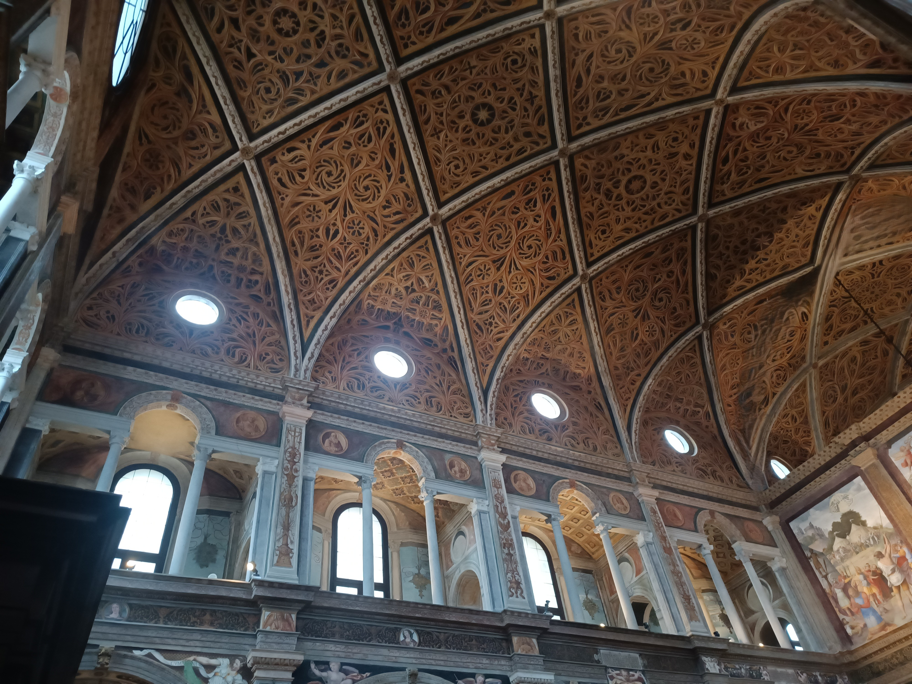
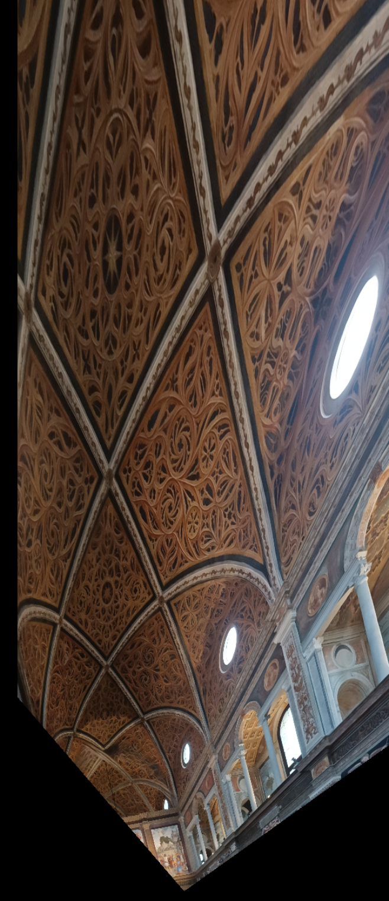
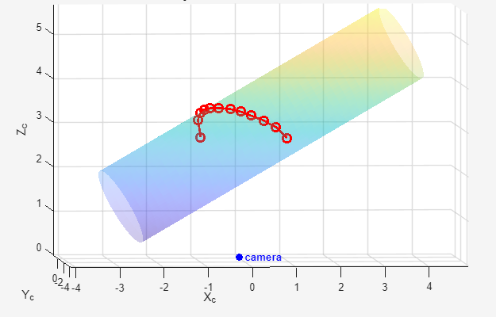

# Single-View Image Rectification and 3D Reconstruction of a Cylindrical Vault
## Results Preview

<div align="center">
  <table>
    <tr>
      <th>Original Image</th>
      <th>Rectified Plane</th>
      <th>3D Vault Reconstruction</th>
    </tr>
    <tr>
      <td></td>
      <td></td>
      <td></td>
    </tr>
  </table>
</div>
This project reconstructs the geometry of a cylindrical vault from a **single uncalibrated image**, using techniques from **projective geometry** and **computer vision**.

Starting from manually extracted geometric features, the pipeline:
- estimates vanishing points and the vanishing line of planes perpendicular to the cylinder axis,
- performs affine and metric rectification,
- calibrates the camera,
- reconstructs the 3D cylinder,
- and recovers 3D points lying on an ogival rib.

The scene is an image of the **San Maurizio church in Milan**, and the reconstruction relies on geometric assumptions about the vault and its rib structure.

---

## Project Overview

The image is acquired by an **uncalibrated zero-skew camera** and shows a **cylindrical vault** with:
- straight segments that are either vertical or horizontal,
- two families of ogival ribs,
- symmetry relations between ribs with respect to specific planes through nodal points.

Using these assumptions, the project builds a full geometric pipeline from 2D image measurements to 3D reconstruction.

---

## Pipeline

### 1. Manual feature extraction
The first step is the manual extraction of:
- vertical lines,
- horizontal lines,
- lines parallel to the cylinder axis,
- and points sampled on two symmetric ogival ribs.

To ensure reproducibility during development, the extracted features are saved in a separate `.mat` file and loaded by the main script.

### 2. Vanishing geometry estimation
Lines belonging to the same 3D direction are converted into homogeneous 2D line representations and stacked into linear systems.  
Because manual annotation is imprecise, vanishing points are estimated with **SVD** rather than exact pairwise intersections.

From these, the code computes:
- the vanishing point of the vertical direction,
- the vanishing point of the horizontal direction,
- the vanishing line of any plane perpendicular to the cylinder axis,
- and the vanishing point of the cylinder-axis direction.

### 3. Stratified image rectification
The rectification is performed in two steps:

#### Affine rectification
The vanishing line is mapped to the line at infinity, removing projective distortion and restoring parallelism in the chosen plane family.

#### Metric rectification
To remove the remaining affine ambiguity, the method exploits the fact that a plane perpendicular to the cylinder axis intersects the vault in a **circle**, which appears in the image as an **ellipse**.  
A set of midpoint constraints is built from symmetric rib pairs using the **harmonic cross-ratio**, and a least-squares ellipse is fitted to these projected midpoints. This ellipse provides the metric constraints needed for Euclidean rectification.

### 4. Camera calibration
Once the plane is rectified, the code estimates the **image of the absolute conic** and recovers the intrinsic calibration matrix `K` under a **zero-skew** assumption.  
The calibration uses:
- constraints induced by the rectified plane homography,
- Zhang-style orthogonality relations,
- and the relation between the vanishing line and the cylinder-axis vanishing point. 

### 5. 3D reconstruction
After calibration, the code:
- fixes the global scale using the known distance between neighboring ribs,
- reconstructs the 3D cylinder in camera coordinates,
- back-projects image points into rays,
- intersects those rays with the reconstructed cylinder,
- and recovers 3D points lying on an ogival rib.

---

## Repository Structure

```text
imagerectification/
├── README.md
├── LICENSE
├── .gitignore
├── src/
│   ├── main.m
│   ├── image_rectification_pipeline.m
│   └── intersect_line_polyline.m
├── data/
|   └──raw/
│       └── san_maurizio.jpg
|   └──processed/
│       ├── 1a-extracted_segments.png
│       └── san_maurizio_features.mat
├── results/
│   ├── 1b-extracted_ribs.png
│   ├── 2-Vanishingpoint_line.png
│   ├── 3-affine.png
│   ├── 4a-rectified(full).png
│   ├── 4b-rectified(chosen).png
│   ├── 5-3D_1.png
│   ├── 5-3D_2.png
│   ├── 5-3D_3.png
│   ├── 5-3D_4.png
│   └── 6-3D_axis.png
└── docs/
    └── Report.pdf
```


## Data

The image `San_Maurizio.jpg` was provided as part of a university assignment and is used here for academic purposes only.

All other data (feature annotations, processed results) are generated by the author.

## Requirements

- MATLAB (tested on R2023 or later)
- Image Processing Toolbox